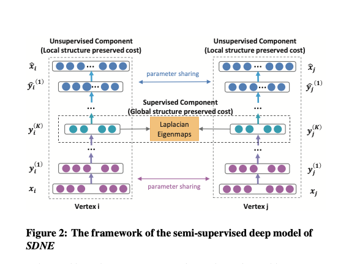

# fun-with-papers

A collection of read papers with comments

# Large batch training of convolutional networks
read: to be

Yang You, Igor Gitman, Boris Ginsburg
(Submitted on 13 Aug 2017)

A common way to speed up training of large convolutional networks is to add computational units. Training is then performed using data-parallel synchronous Stochastic Gradient Descent (SGD) with mini-batch divided between computational units. With an increase in the number of nodes, the batch size grows. But training with large batch size often results in the lower model accuracy. We argue that the current recipe for large batch training (linear learning rate scaling with warm-up) is not general enough and training may diverge. To overcome this optimization difficulties we propose a new training algorithm based on Layer-wise Adaptive Rate Scaling (LARS). Using LARS, we scaled Alexnet up to a batch size of 8K, and Resnet-50 to a batch size of 32K without loss in accuracy.

- [paper](https://arxiv.org/abs/1708.03888)
- [with comments](docs/1708.03888.pdf)

# Unsupervised Feature Learning via Non-Parametric Instance-level Discrimination
read: to be

Zhirong Wu, Yuanjun Xiong, Stella Yu, Dahua Lin
(Submitted on 5 May 2018)

Neural net classifiers trained on data with annotated class labels can also capture apparent visual similarity among categories without being directed to do so. We study whether this observation can be extended beyond the conventional domain of supervised learning: Can we learn a good feature representation that captures apparent similarity among instances, instead of classes, by merely asking the feature to be discriminative of individual instances? We formulate this intuition as a non-parametric classification problem at the instance-level, and use noise-contrastive estimation to tackle the computational challenges imposed by the large number of instance classes. Our experimental results demonstrate that, under unsupervised learning settings, our method surpasses the state-of-the-art on ImageNet classification by a large margin. Our method is also remarkable for consistently improving test performance with more training data and better network architectures. By fine-tuning the learned feature, we further obtain competitive results for semi-supervised learning and object detection tasks. Our non-parametric model is highly compact: With 128 features per image, our method requires only 600MB storage for a million images, enabling fast nearest neighbour retrieval at the run time.

- [paper](https://arxiv.org/abs/1805.01978)

# A Simple Framework for Contrastive Learning of Visual Representations
read: 2020-03-29

Ting Chen, Simon Kornblith, Mohammad Norouzi, Geoffrey Hinton
(Submitted on 13 Feb 2020)

This paper presents SimCLR: a simple framework for contrastive learning of visual representations. We simplify recently proposed contrastive self-supervised learning algorithms without requiring specialized architectures or a memory bank. In order to understand what enables the contrastive prediction tasks to learn useful representations, we systematically study the major components of our framework. We show that (1) composition of data augmentations plays a critical role in defining effective predictive tasks, (2) introducing a learnable nonlinear transformation between the representation and the contrastive loss substantially improves the quality of the learned representations, and (3) contrastive learning benefits from larger batch sizes and more training steps compared to supervised learning. By combining these findings, we are able to considerably outperform previous methods for self-supervised and semi-supervised learning on ImageNet. A linear classifier trained on self-supervised representations learned by SimCLR achieves 76.5% top-1 accuracy, which is a 7% relative improvement over previous state-of-the-art, matching the performance of a supervised ResNet-50. When fine-tuned on only 1% of the labels, we achieve 85.8% top-5 accuracy, outperforming AlexNet with 100X fewer labels.

- [paper](https://arxiv.org/abs/2002.05709)
- [with comments](docs/2002.05709.pdf)
- [The Illustrated SimCLR Framework](https://amitness.com/2020/03/illustrated-simclr/)
- [Google AI Blog](https://ai.googleblog.com/2020/04/advancing-self-supervised-and-semi.html)
- [Github](https://github.com/google-research/simclr)

# Structural Deep Network Embedding
read 2020-03-01

Network embedding is an important method to learn low-dimensional representations of vertexes in networks, aiming to capture and pre- serve the network structure. Almost all the existing network embedding methods adopt shallow models. However, since the underlying network structure is complex, shallow models cannot capture the highly non-linear network structure, resulting in sub-optimal network representations. Therefore, how to find a method that is able to effectively capture the highly non-linear network structure and preserve the global and local structure is an open yet important problem. To solve this problem, in this paper we propose a Structural Deep Network Embedding method, namely SDNE. More specifically, we first propose a semi-supervised deep model, which has multiple layers of non-linear functions, thereby being able to capture the highly non-linear network structure. Then we propose to exploit the first-order and second-order proximity jointly to p- reserve the network structure. The second-order proximity is used by the unsupervised component to capture the global network structure. While the first-order proximity is used as the supervised information in the supervised component to preserve the local network structure. By jointly optimizing them in the semi-supervised deep model, our method can preserve both the local and global network structure and is robust to sparse networks. Empirically, we conduct the experiments on five real-world networks, including a language network, a citation network and three social networks. The results show that compared to the baselines, our method can reconstruct the original network significantly better and achieves substantial gains in three applications, i.e. multi-label classification, link prediction and visualization.

- [paper](https://www.kdd.org/kdd2016/subtopic/view/structural-deep-network-embedding)
- [with comments](docs/rfp0191-wangAemb_edit.pdf)

# Graph Embedding Techniques, Applications, and Performance: A Survey
read: 2020-02-26

Palash Goyal and Emilio Ferrara

Graphs, such as social networks, word co-occurrence networks, and communication networks, occur naturally in various real-world applications. Analyzing them yields insight into the structure of society, language, and different patterns of communication. Many approaches have been proposed to perform the analysis. Recently, methods which use the representation of graph nodes in vector space have gained traction from the research community. In this survey, we provide a comprehensive and structured analysis of various graph embedding techniques proposed in the literature. We first introduce the embedding task and its challenges such as scalability, choice of dimensionality, and features to be preserved, and their possible solutions. We then present three categories of approaches based on factorization methods, random walks, and deep learning, with examples of representative algorithms in each category and analysis of their performance on various tasks. We evaluate these state-of-the-art methods on a few common datasets and compare their performance against one another. Our analysis concludes by suggesting some potential applications and future directions. We finally present the open-source Python library we developed, named GEM (Graph Embedding Methods, available at https://github.com/palash1992/GEM), which provides all presented algorithms within a unified interface to foster and facilitate research on the topic.

- [paper](https://arxiv.org/abs/1705.02801)
- [with comments](docs/1705.02801v4_edit_v2.pdf)
