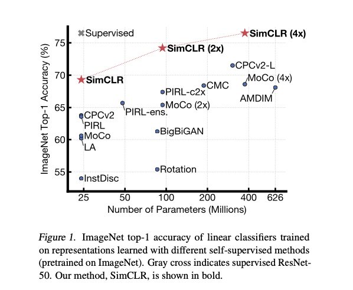
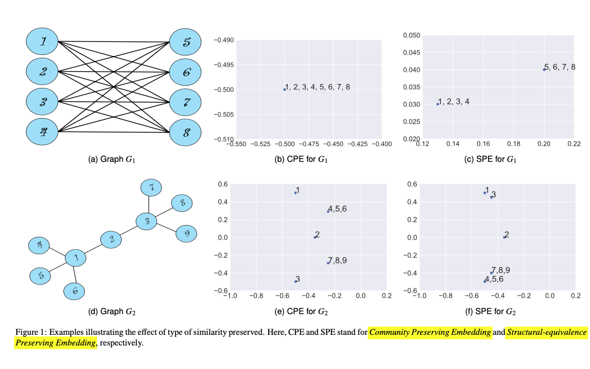

# fun-with-papers

A collection of read papers with comments

# A Simple Framework for Contrastive Learning of Visual Representations
read: 2020-03-29

Ting Chen, Simon Kornblith, Mohammad Norouzi, Geoffrey Hinton
(Submitted on 13 Feb 2020)

This paper presents SimCLR: a simple framework for contrastive learning of visual representations. We simplify recently proposed contrastive self-supervised learning algorithms without requiring specialized architectures or a memory bank. In order to understand what enables the contrastive prediction tasks to learn useful representations, we systematically study the major components of our framework. We show that (1) composition of data augmentations plays a critical role in defining effective predictive tasks, (2) introducing a learnable nonlinear transformation between the representation and the contrastive loss substantially improves the quality of the learned representations, and (3) contrastive learning benefits from larger batch sizes and more training steps compared to supervised learning. By combining these findings, we are able to considerably outperform previous methods for self-supervised and semi-supervised learning on ImageNet. A linear classifier trained on self-supervised representations learned by SimCLR achieves 76.5% top-1 accuracy, which is a 7% relative improvement over previous state-of-the-art, matching the performance of a supervised ResNet-50. When fine-tuned on only 1% of the labels, we achieve 85.8% top-5 accuracy, outperforming AlexNet with 100X fewer labels.

- [paper](https://arxiv.org/abs/2002.05709)
- [with comments](2002.05709.pdf)

# Graph Embedding Techniques, Applications, and Performance: A Survey
read: 2020-02-26

Palash Goyal and Emilio Ferrara

Graphs, such as social networks, word co-occurrence networks, and communication networks, occur naturally in various real-world applications. Analyzing them yields insight into the structure of society, language, and different patterns of communication. Many approaches have been proposed to perform the analysis. Recently, methods which use the representation of graph nodes in vector space have gained traction from the research community. In this survey, we provide a comprehensive and structured analysis of various graph embedding techniques proposed in the literature. We first introduce the embedding task and its challenges such as scalability, choice of dimensionality, and features to be preserved, and their possible solutions. We then present three categories of approaches based on factorization methods, random walks, and deep learning, with examples of representative algorithms in each category and analysis of their performance on various tasks. We evaluate these state-of-the-art methods on a few common datasets and compare their performance against one another. Our analysis concludes by suggesting some potential applications and future directions. We finally present the open-source Python library we developed, named GEM (Graph Embedding Methods, available at https://github.com/palash1992/GEM), which provides all presented algorithms within a unified interface to foster and facilitate research on the topic.

- [paper](https://arxiv.org/abs/1705.02801)
- [with comments](1705.02801v4_edit_v2.pdf)
